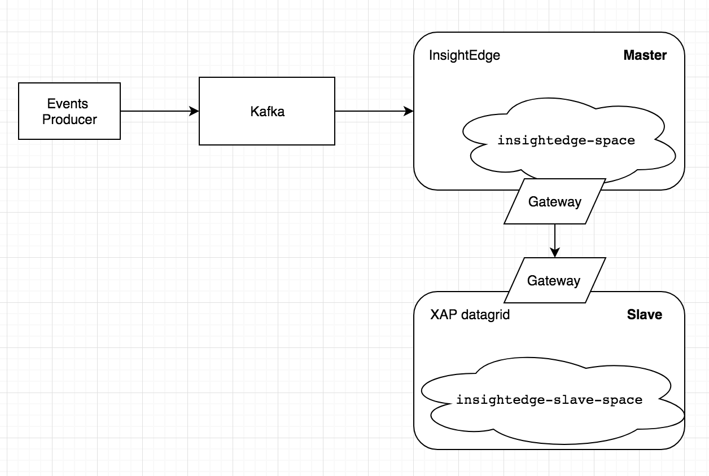

# Magic WAN replication demo

On this image represented high level diagram of the components and data flow in the demo application.
 
The messages are generated by the `Events Producer` and are sent to the `Kafka`.
The `events-streaming` job is run on the `InsightEdge (Master)` cluster and save the result to the `insightedge-space`.
The gateways are configured to replicate date from `insightedge-space` to `insightedge-slave-space`, to have the copy of the data on the `Slave Datagrid`

### To run the demo make the following steps:

###### Note: All script should be run from the `scripts` folder

 1. Setup evn variables: 
    - Make sure you have Maven and Java installed on your system
    - Install `Insigtedge 1.0.0` (**with ENTERPRISE license supporting WAN add-on**) and setup `INSIGHTEDGE_HOME` env variable
    - Install `Kafka 2.10-0.9.0.0` and setup `KAFKA_HOME` env variable
 
 1. Make a build: 
    - Run command: `./build.sh`
 
 1. Start Insightedge: 
    - Run command: `./start-insightedge.sh`
    
 1. Start Slave datagrid:
    - Run command in separate window: `./start-slave.sh`
    
 1. Start GS UI:
    - Run command: `./start-gs-ui.sh`
    - Configure slave locator:
        - Open `Settings > Discovery > Locator Management...`:
        
        - Add `127.0.0.1:9999` and `127.0.0.1:4174` lookup locators:
        
    
 1. Open Web UI:
    - Open link: `http://[SERVER_IP]:8099/`
    - fill locators with: `127.0.0.1:4174,127.0.0.1:9999`
    
    
 1. Deploy Events Master space:
    - Run command: `./deploy-events-space.sh`
    
 1. Deploy Events Slave space:
    - Run command: `./deploy-events-slave-space.sh`
    
 1. Observe all spaces and gateways are deployed:
    - in gs-ui:
    
    - in gs-web-ui:
    
    
 1. Start Kafka:
    - Run command: `./start-kafka.sh`
 
 1. Start streaming job:
    - Run command: `./start-spark-streaming.sh`
 
 1. Start events producer:
    - Run command: `./start-kafka-producer.sh`
    
 1. Observe replicated messages:
    - gs ui
    
    - web ui:
    
    

