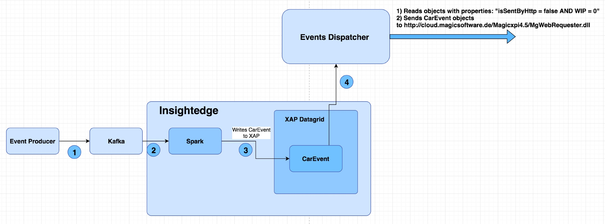
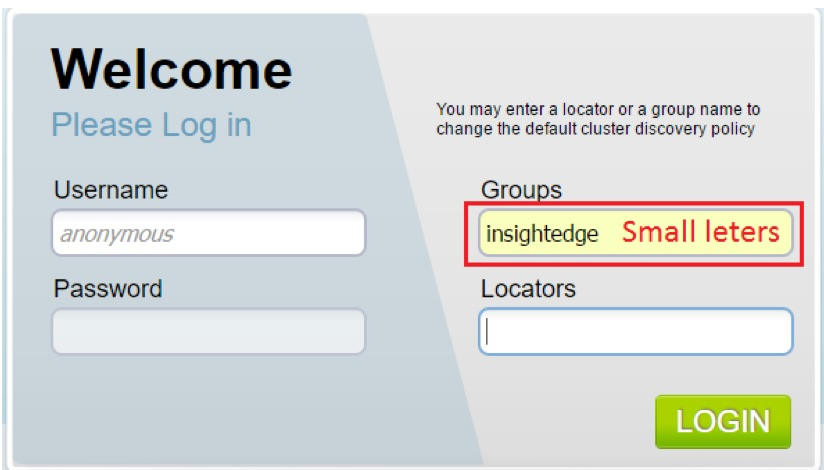

# Deploy Kafka and Spark with InsightEdge

1.	Kill all java processes
1.	Move to Local scripts folder folder `cd /home/experian/demo/insightedge-iot-cars/scripts`
1.	Start Kafka
    - ./start-kafka.sh
1.	Start InshightEdge
    - ./start-insightedge.sh
1.	Now we can connect with the browser to:
    - http://13.90.100.177:8099/ InsighEdge management and Zeppelin
    - fill Groups: insightedge
    - and Locators: 127.0.0.1:4174

    

    - `http://13.90.100.177:8090/ - / (Zeppelin)`

1.	Start Spark Job:
    - ./start-spark-streaming.sh
1.	Start producer:
    - ./start-kafka-producer-small-input.sh
1.	When the space is filled run Http XPI Dispatching:
    - ./start-xpi-dispatcher.sh
